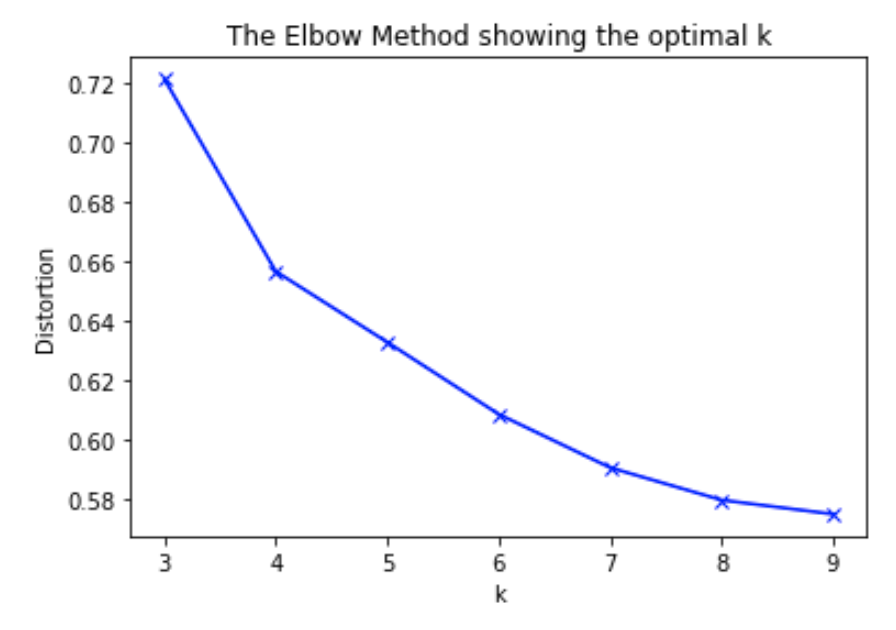

### Contributors:
- Felipe Rojos @farojos
- Felipe Ruiz @feliperuizp

# **Informe Tarea 2**

Todo el código está disponible en las carpetas pregunta1, pregunta2 y pregunta3 de este repositorio.

## 1. **Análisis de sentimientos en Críticas de películas**

### Actividad 1:

Para esta parte de la tarea, se uso el mismo preprocesamiento en ambos metodos (bow, w2v) por lo que el diccionario resultante es el mismo (independiente que w2v pueda no encontrar una codificación). Se uso regex para eliminar terminos especiales (',','.',.....). Se uso stemming para cada palabra, lo que dejo el siguiente diccionario en cada dataset:

- Polarity dataset : 31749
- Large Movie Review Dataset : 188827

Respecto a las palabras más comunes en Polarity dataset:

- ('film', 11108)
- ('movi', 6855)
- ('one', 5758)
- ('like', 3997)
- ('charact', 3855)

Respecto a las palabras menos comunes en Polarity dataset:

- ('santostefano', 1)
- ('alin', 1)
- ('brosh', 1)
- ('romanticmistaken', 1)
- ('bulimia', 1)

Respecto a las palabras más comunes en Large Movie Review Dataset:

- ('br', 172997)
- ('movi', 148728)
- ('film', 140146)
- ('one', 80787)
- ('like', 66619)

Respecto a las palabras menos comunes en Large Movie Review Dataset:

- ('exorcistbut', 1)
- ('badmitton', 1)
- ('membershipbr', 1)
- ('dilemmasbr', 1)
- ('freedomhat', 1)


### Actividad 2:

### Actividad 3:

## 2. **Análisis de sentimientos en Twitter**

### Actividad 4:

Primero se procesan los vectores de spanish-word-embeddings del profesor Jorge Pérez de la Universidad de Chile. Se descargan localmente 10.000.000 de palabra para Word2Vector, FastText y Glove.

Los tiempos para descargar los vectores son:
- Word2Vec: 285 segundos
- FastText: 259 segundos
- Glove: 251 segundos

Luego para procesar el dataset de Tweets, se utiliza la librería nltk:
```
import nltk
from nltk.stem import SnowballStemmer
from nltk.corpus import stopwords
from nltk.tokenize import RegexpTokenizer
```

Luego se carga el Stemmer en español, las Stopwords en español para limpiar el contenido de cada tweet y el Tokenizer.

El dataset tiene la variable "polarities" y "polarities type", solo se utilizan las "polarities" ya que en el dataset de test solo se encuentra esa variable.

Polarities puede tomar 6 valores, lo que se representa con un número del 0 al 5.
```
polarities=['NONE', 'NEU', 'P', 'N+', 'P+', 'N']
````

 Se procesan los tweets para obtener una lista tweets, cada tweet queda representado como: 
 ```
 [[Lista de palabras no vectorizadas del contenido del tweet],polaridad]
```
El tiempo de procesamiento para esto es de:
- 6 segundos para el dataset de entrenamiento (7219 tweets). Hay tweets que no tienen contenido en el dataset, por lo que son eliminados.
- 50 segundos para el dataset de test (60789 tweets)

### Actividad 5:

 Luego para cada tweet se vectorizan sus palabras y se calcula el promedio de los vectores del contenido, para obtener los tweets de la siguiente forma:

 ```
 [vector promedio,polaridad]
```

Se realiza esta tarea para los tres métodos Word2Vector, FastText y Glove.

El tiempo de procesamiento para vectorizar los datos es de:
- 1.7 segundos para el dataset de entrenamiento
- 12.8 segundos para el dataset de test

Finalmente se entrena el modelo para los tres métodos con svm.

Los tiempos de entrenamiento de los modelos son de:
- 22.04 segundos para Word2Vector
- 20.58 segundos para FastText
- 22.99 segundos para Glove

Los resultados son:
- Training Set Accuracy Word2Vector: 0.371364653244
- Test Set Accuracy Word2Vector: 0.470426455482
- Training Set Accuracy FastText: 0.479166666667
- Test Set Accuracy FastText: 0.451224361311
- Training Set Accuracy Glove: 0.470078299776
- Test Set Accuracy Glove: 0.425875608867

```
Confussion matrix W2V:
 [[ 9459     0   229    15  4966  6450]
 [  118     0    11     1   379   796]
 [  372     0    36     0   631   446]
 [  673     0    50    21   784  3026]
 [ 4536     0   155     5 11910  4023]
 [ 2223     0   107    11  1957  6968]]

Confussion matrix FastText:
 [[ 9326   657  2272  1063  3709  4092]
 [  100    94   177   142   260   532]
 [  246    44   643    37   296   219]
 [  482   130   327  1684   438  1493]
 [ 4133   540  2888   566 10187  2315]
 [ 1960   490  1135  1179  1201  5301]]

Confussion matrix Glove:
 [[8919  823 2661 1367 3341 4008]
 [ 110  136  183  162  241  473]
 [ 220   69  653   53  273  217]
 [ 538  169  431 1537  482 1397]
 [4146  757 3032  899 9398 2397]
 [1925  559 1201 1263 1256 5062]]
```

### Actividad 6:

El rendimiento del modelo entrenado es pésimo para los 3 codificadores de vectores. Para FastText y Glove es un poco mejor que para Word2Vector. Esto se puede explicar ya que los tweets son generalmente palabras mal escritas y # que contienen varias palabras sin separar que no son entendidas por nuestro procesamiento de palabras.

Consecuentemente, las matrices de confusión no obtienen un buen resultado, donde se ve claramente que nuestro modelo predice un resultado erróneo para la mayoría de los casos.

## 3. **Entrenar un Modelo de Clasificación de Textos**

### Actividad 7:

El texto elegido es el primer libre de la saga Canción de hielo y fuego, titulado Juego de Tronos. El archivo es un .txt de 1.8mb, 25656 líneas, 1772149 carácteres y 316495 palabras.

Los datos fueron procesados en un Macbook Pro con i7-7920hq, SSD 1tb con tasa de transferencia de 2.5gb/s, 16gb de ram a 2400mH.

El preprocesamiento fue de eliminar los stopwords, los símbolos irregulares, procesar con stemming todas las palabras y finalmente contar la ocurrencia de cada palabra. Sobre eso corremos un modelo word to vector, con 100 features y 10 epochs de entrenamiento.

El resultado es un diccionario de la forma {"palabra": frecuencia}.

El tiempo de entrenamiento del modelo es de 1.57 segundos.

Las palabras más frecuentes son:

```
('dijo', 1608)
('ser', 1231)
('hombr', 1116)
('si', 1108)
('lord', 855)
('jon', 838)
('rey', 823)
('mano', 801)
('ned', 773)
('señor', 703)

```

### Actividad 8:

Las 5 palabras que se consideran más relevantes en nuestro dataset(apreciación personal) y sus palabras respectivas más frecuentes son (las palabras respectivas que aparecen tienen coherencia semántica respecto a las palabras elegidas) :

- Sansa
```
    1. ('arya', 0.9089903831481934)
    2. ('decepciona', 0.821498453617096)
    3. ('liláceo', 0.8086718320846558)
    4. ('dama', 0.800781786441803)
    5. ('mordan', 0.794775664806366)
    6. ('soñast', 0.7854097485542297)
    7. ('acompañando', 0.7653645277023315)
    8. ('paseó', 0.7625895738601685)
    9. ('legítima', 0.7607917785644531)
    10. ('septa', 0.7587180137634277)
```

Arya es la hermana de Sansa. El resto son adjetivos y actividades sobre el personaje de Sansa. Un ejemplo claro es septa, mujeres con las cuales Sansa tiene una gran interacción.

- Jon
```
    1. ('catelyn', 0.8442196846008301)
    2. ('chico', 0.8186751008033752)
    3. ('bran', 0.8016278743743896)
    4. ('sam', 0.8001469969749451)
    5. ('partí', 0.7918548583984375)
    6. ('robb', 0.7882533073425293)
    7. ('deserción', 0.7464160919189453)
    8. ('sonrisa', 0.7454900741577148)
    9. ('pyp', 0.740380585193634)
    10.('clavando', 0.7379851937294006)
```

Catelyn es la madre adoptiva, Bran y Robb son hermanos y Sam es su amigo. Deserción es cuando Jon quiere desertar a los nigth watch para acompañar a su hermano Robb a la guerra para recuperar a su padre.

- Ned
```
    1. ('joffrey', 0.8286762833595276)
    2. ('meñiqu', 0.8230651617050171)
    3. ('cersei', 0.7824473977088928)
    4. ('exenta', 0.7789955139160156)
    5. ('robert', 0.7735979557037354)
    6. ('inclinando', 0.7665606141090393)
    7. ('quejado', 0.7642755508422852)
    8. ('fruncido', 0.7628276944160461)
    9. ('joff', 0.7614621520042419)
    10. ('acompañando', 0.7599129676818848)
```

Joffrey (y joff) es hijo de robbert y heredero al trono, el cual lo declara a muerte por intento de apropiación del trono.  Meñique es un personaje relacionado con toda la realeza, el cual estaba enamorado de su esposa Catelyn y tambien lo traisiona al momento de tomar el trono. Cersei es la enemiga y la esposa de su mejor amigo. Robbert es su mejor amigo y el rey de westeros.

- Lannister
```
    1. ('abism', 0.8227126002311707)
    2. ('jaim', 0.7731848955154419)
    3. ('hermano', 0.7717587351799011)
    4. ('considerará', 0.7697587013244629)
    5. ('escriba', 0.7456368207931519)
    6. ('marchaba', 0.7370457649230957)
    7. ('ventaja', 0.7346108555793762)
    8. ('portavoz', 0.7309443354606628)
    9. ('gnomo', 0.7308033108711243)
    10.('bledo', 0.7282035946846008)
```

En este conjunto de palabras no se identifica tan claramente la relación. Jaime es un Lannister. Hay dos hermanos. Hay un Lannister que es portavoz del rey.

- Targaryen
```
   1. ('aegon', 0.9806841611862183)
   2. ('ori', 0.9668578505516052)
   3. ('conquistador', 0.9617517590522766)
   4. ('rhaegar', 0.9612633585929871)
   5. ('conquistado', 0.9605289697647095)
   6. ('aeri', 0.9520219564437866)
   7. ('dorn', 0.9489178657531738)
   8. ('alianza', 0.9429525136947632)
   9. ('u', 0.9373108148574829)
   10. ('corona', 0.9344648718833923) 
```

Aegon, Orys, Rhaegar, Aerion son personajes de la casa Targaryen.
Son una familia real, por lo que corona, alianza y conquistador están relacionados. Dorn es un reino el cual tiene buenas relaciones con esta casa. Conquistado tiene que ver con que ellos tuvieron el poder completo de westeros mediante la fuerza (de sus dragones). 

Dado lo anterior, podemos ver una clara relación entre estas palabras elegidas (con sus mas similares).

Por último se realiza un k-means con las palabras de nuestro modelo. Para elegir el k, se utilizó el método Elbow. Se elige k=5 ya que es el k cuando el modelo empieza a mejorar muy poco su dispersión al aumentar el k. Por último, se analiza la dispersión, frecuencia promedio y las palabras más significativas de los cluster elegidos.



Los resultados son:
```
Cluster 0, top 10 palabras más comunes con sus frecuencias:
    ['colemon', 13], 
    ['pausa', 12],
    ['conquistador', 12],
    ['equivocado', 11],
    ['arrancarl', 11],
    ['imaginado', 11],
    ['reunido', 11],
    ['othor', 11],
    ['dedicado', 10]]
Dispersion cluster 0:  0.7725061042655149
Freq promedio cluster 0:  3.317608991825613
```
Este cluster representa palabras poco frecuentes en el libro (promedio bajo, solo aparición promedio < 4 por palabra), por lo que el embeding creado por w2v no los relaciona mucho con otros conceptos, dejando asi un cluster con baja dispersión (dado que no hay mucha informacion para para relacionarlos con otros conceptos). Es decir que son poco relevantes y no están relacionados con eventos ni personajes importantes del libro.

Para analizar los dos clusters siguientes, es importante comentar el contexto del libro.

```
Cluster 1, top 10 palabras más comunes con sus frecuencias:
    ['tan', 578],
    ['dos', 391],
    ['gran', 256],
    ['tres', 198],
    ['vino', 175],
    ['castillo', 164],
    ['dragón', 151],
    ['último', 131],
    ['viseri', 122],
    ['part', 121]
Dispersion cluster 1:  0.8215536927288243
Freq promedio cluster 1:  14.129516658845612
```
En el cluster 1 podemos ver como las palabras mas significativas del cluster tienen que ver un concepto, los Targaryen. Castillo, dragón, viseri(viserys targaryen, hermano de danearys), último(son los ultimos herederos de la casa de Targaryen)

```
Cluster 2, top 10 palabras más comunes con sus frecuencias:
    ['mano', 801],
    ['tyrion', 597],
    ['hacia', 575],
    ['espada', 559],
    ['mientra', 534],
    ['bran', 513],
    ['caballo', 481],
    ['vez', 453],
    ['dani', 444],
    ['arya', 439]
Dispersion cluster 2:  1.1120688629206883
Freq promedio cluster 2:  61.96994991652755
```

Por último, el cluster 2 muestra a personajes y conceptos relacionados con ellos. Por ejemplo mano hace mención a la mano derecha del rey(eddard stark), Tyrion es un Lannister, Bran es un stark, Dani es la forma en que Viserys se dirije a su hermana Danearys, arya es una stark. La dispersion en este cluster se debe a que sus palabras aparecen tanto en el libro que se pueden relacionar con demasiados conceptos, sobretodo con acciones.
